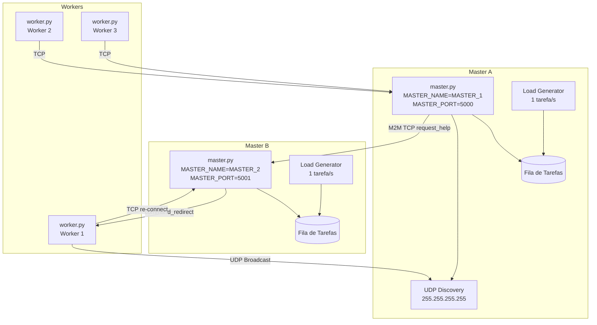
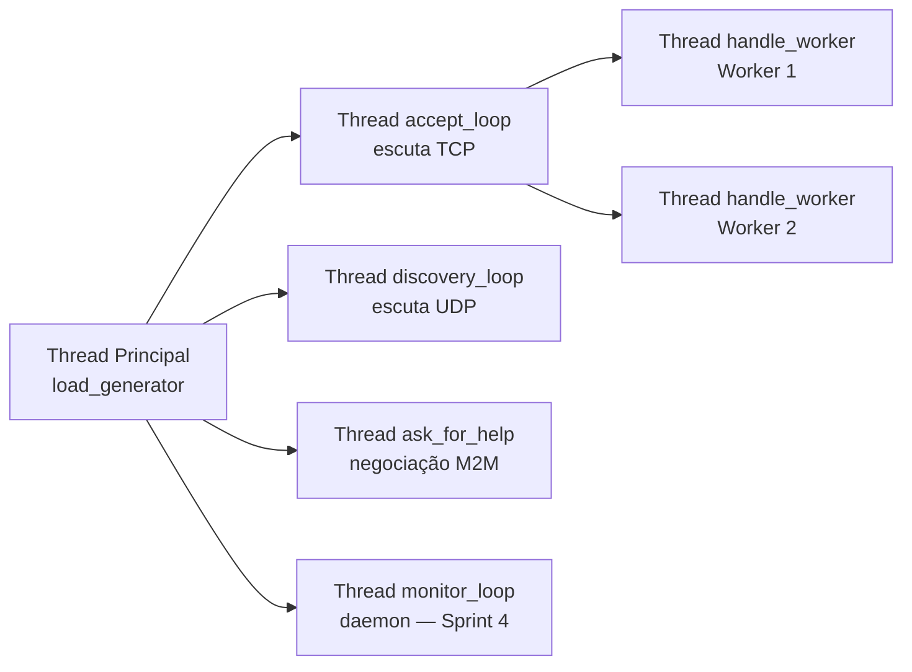
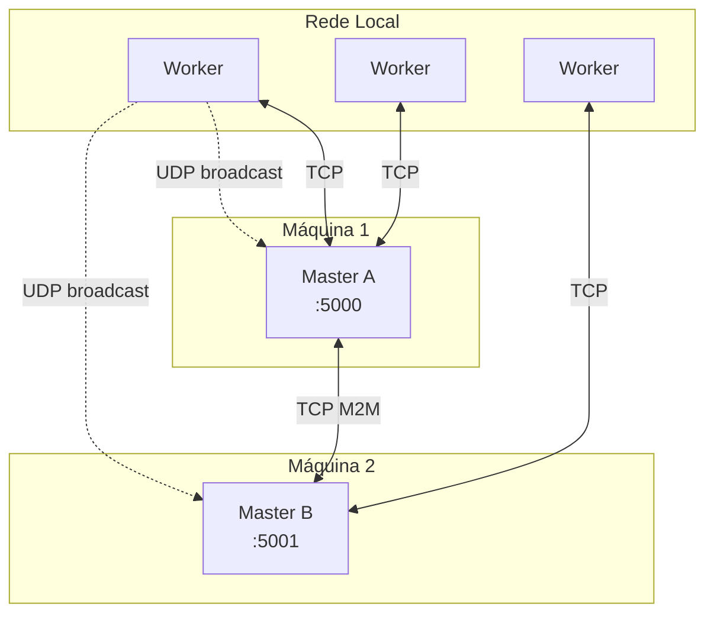
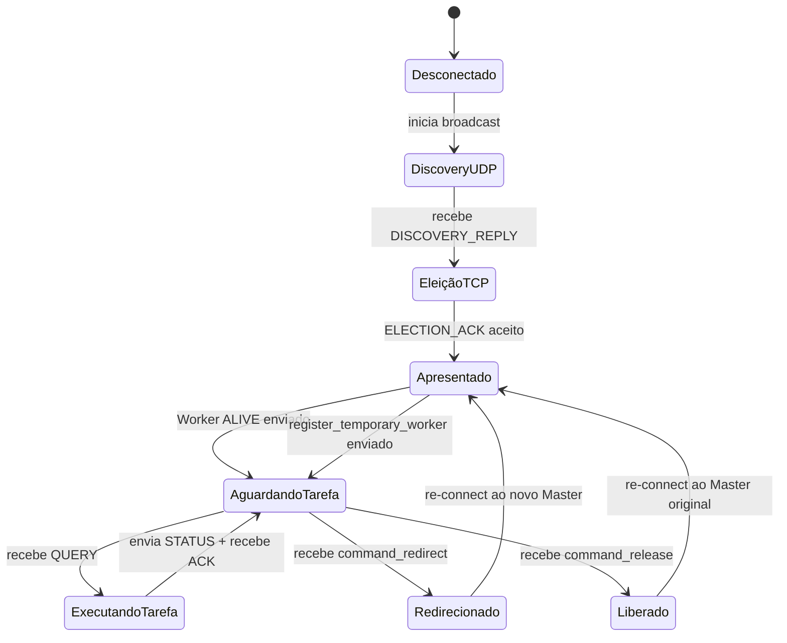

# Arquitetura do Sistema P2P

## Visão Geral

O sistema é um middleware de balanceamento de carga distribuído baseado em comunicação TCP/UDP.
Dois tipos de processos coexistem: **Master** (servidor de tarefas) e **Worker** (executor de tarefas).
Múltiplos Masters podem cooperar entre si para distribuir carga em momentos de saturação.

---

## Componentes

| Arquivo           | Papel                                                              |
|-------------------|--------------------------------------------------------------------|
| `master.py`       | Aceita workers, gera tarefas, monitora carga, negocia com vizinhos |
| `worker.py`       | Descobre masters via UDP, conecta via TCP, executa tarefas         |
| `config.py`       | Centraliza todos os parâmetros do sistema (portas, limiares, UUIDs)|
| `monitor.py`      | Sprint 4: coleta métricas e envia ao supervisor via TLS TCP        |
| `requirements.txt`| Dependências externas (`psutil>=5.9.0`)                            |

---

## Diagrama de Componentes



---

## Modelo de Threads

Cada processo Master roda com o seguinte conjunto de threads:



**Locks utilizados:**

| Lock                          | Protege                                        |
|-------------------------------|------------------------------------------------|
| `pending_lock`                | contador de tarefas pendentes                  |
| `task_queue_lock`             | fila de tarefas (`task_queue`)                 |
| `worker_state_lock`           | dicionários `workers` e `worker_metadata`      |
| `help_request_lock`           | flag `help_request_in_progress`                |
| `borrowed_outgoing_workers_lock` | rastreamento de workers emprestados         |
| `s4_tasks_running_lock`       | set de workers processando tarefas (Sprint 4)  |
| `s4_counters_lock`            | contadores tasks_ok/nok/workers_dropped (S4)   |
| `s4_enqueue_lock`             | timestamps de enfileiramento para oldest_age   |
| `s4_neighbor_lock`            | status das conexões M2M com vizinhos           |

---

## Diagrama de Implantação (Apresentação)



---

## Fluxo de Estado de um Worker



---

## Histecresia de Carga

O sistema usa dois limiares distintos para evitar oscilações rápidas (efeito *flapping*):

```
Pendentes ──────────────────────────────────────────────►
         0    1    2    3    4    5    6    7
                   ▲              ▲
                RELEASE_       LOAD_
               THRESHOLD=3  THRESHOLD=5

 ≤ 3: liberar workers emprestados (carga normalizada)
 > 5: solicitar ajuda ao vizinho (saturação)
 3 < x ≤ 5: zona neutra — nenhuma ação
```

---

## Variáveis de Ambiente Principais

| Variável                      | Padrão          | Descrição                                  |
|-------------------------------|-----------------|--------------------------------------------|
| `MASTER_NAME`                 | `MASTER_1`      | Nome único do Master (usado na eleição)    |
| `MASTER_HOST`                 | `127.0.0.1`     | IP anunciado para workers                  |
| `MASTER_PORT`                 | `5000`          | Porta TCP do Master                        |
| `MASTER_BIND_HOST`            | `0.0.0.0`       | Interface de escuta                        |
| `NEIGHBOR_MASTERS`            | `""`            | `host:porta,host:porta` — vizinhos M2M     |
| `DISCOVERY_PORT`              | `= MASTER_PORT` | Porta UDP de descoberta                    |
| `SPRINT3_HELP_TIMEOUT`        | `5.0`           | Timeout (s) para negociação M2M            |
| `SPRINT3_DEFAULT_WORKERS_TO_BORROW` | `1`     | Workers solicitados por padrão             |
| `SUPERVISOR_HOST`             | `nuted-ia.dev`  | Host do supervisor de métricas (Sprint 4)  |
| `SUPERVISOR_PORT`             | `443`           | Porta TLS do supervisor (Sprint 4)         |
| `SUPERVISOR_SNI`              | `nuted-ia.dev`  | SNI para handshake TLS (Sprint 4)          |
| `SUPERVISOR_INTERVAL`         | `10.0`          | Intervalo de envio de métricas em segundos |
| `FARM_ID`                     | `= MASTER_NAME` | Identificador da farm no payload           |
| `FARM_HOSTNAME`               | `socket.gethostname()` | Hostname reportado no payload       |
