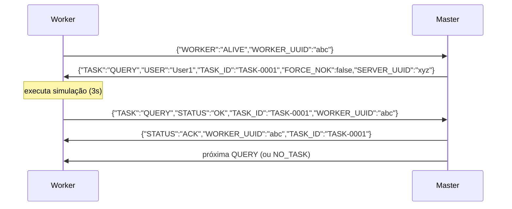
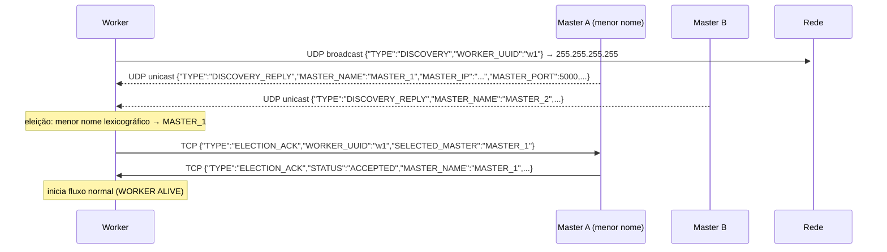
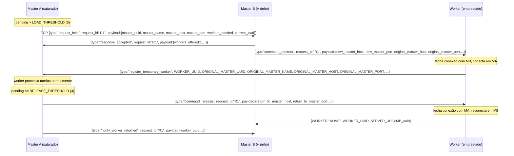
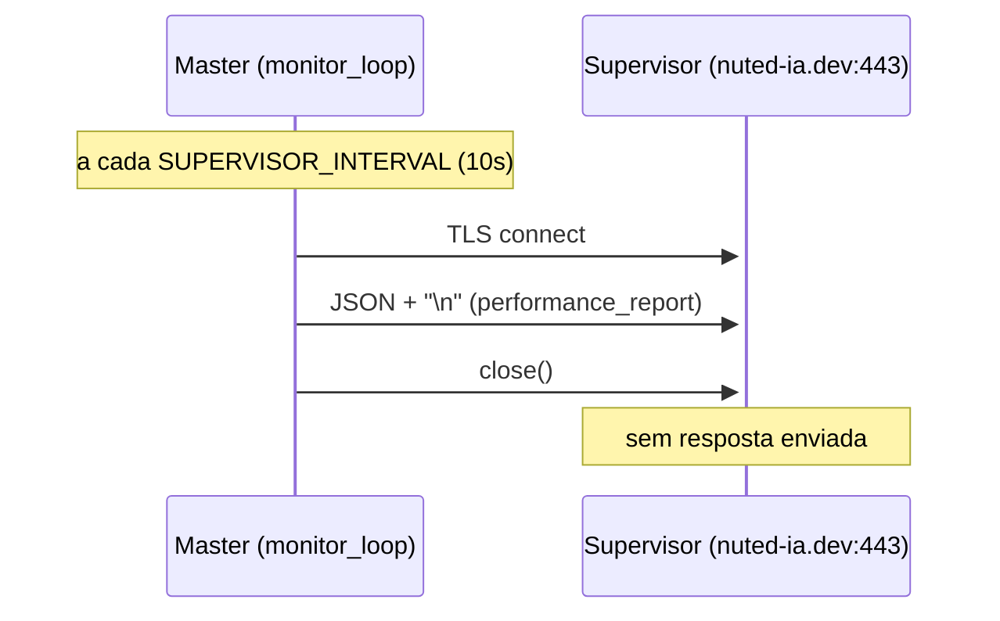

# Protocolo de Comunicação

Todas as mensagens trafegam como **JSON de linha única** seguido de `\n` (newline-delimited JSON).
Encoding: UTF-8. Transport: TCP (todas as mensagens de controle) e UDP (apenas discovery).

---

## Convenções de Formato

### Mensagens legadas (Sprints 1 e 2)

Campos em `UPPER_CASE` diretamente no objeto raiz:

```json
{ "WORKER": "ALIVE", "WORKER_UUID": "<uuid>" }
```

### Mensagens Sprint 3 (M2M e redirect)

Envelope padronizado com três campos obrigatórios:

```json
{
  "type": "<tipo>",
  "request_id": "<uuid>",
  "payload": { ... }
}
```

O `request_id` correlaciona request/response e evita duplicatas.

---

## Sprint 1 — Heartbeat

### Worker → Master (apresentação)
```json
{ "WORKER": "ALIVE", "WORKER_UUID": "abc-123" }
```

### Master → Worker (resposta de heartbeat)
```json
{ "SERVER_UUID": "xyz-456", "TASK": "HEARTBEAT", "RESPONSE": "ALIVE" }
```

### Worker → Master (heartbeat periódico a cada 30s)
```json
{ "TASK": "HEARTBEAT", "WORKER_UUID": "abc-123", "SERVER_UUID": "xyz-456" }
```

---

## Sprint 2 — Ciclo Completo de Tarefas



### Master → Worker (despacho de tarefa)
```json
{
  "TASK": "QUERY",
  "USER": "User1",
  "TASK_ID": "TASK-0001",
  "FORCE_NOK": false,
  "SERVER_UUID": "xyz-456"
}
```

### Worker → Master (relatório de status)
```json
{
  "TASK": "QUERY",
  "STATUS": "OK",
  "TASK_ID": "TASK-0001",
  "WORKER_UUID": "abc-123"
}
```
`STATUS` pode ser `"OK"` (sucesso) ou `"NOK"` (falha simulada; acontece quando `FORCE_NOK=true`).

### Master → Worker (confirmação)
```json
{ "STATUS": "ACK", "WORKER_UUID": "abc-123", "TASK_ID": "TASK-0001" }
```

### Master → Worker (sem tarefa disponível)
```json
{ "TASK": "NO_TASK", "SERVER_UUID": "xyz-456" }
```

---

## Sprint 2.1 — Descoberta UDP e Eleição



### Worker → Masters (broadcast UDP)
```json
{ "TYPE": "DISCOVERY", "WORKER_UUID": "abc-123" }
```

### Master → Worker (resposta unicast UDP)
```json
{
  "TYPE": "DISCOVERY_REPLY",
  "MASTER_NAME": "MASTER_1",
  "MASTER_IP": "127.0.0.1",
  "MASTER_PORT": 5000,
  "STATUS": "AVAILABLE",
  "SERVER_UUID": "xyz-456"
}
```

### Worker → Master eleito (TCP)
```json
{
  "TYPE": "ELECTION_ACK",
  "WORKER_UUID": "abc-123",
  "SELECTED_MASTER": "MASTER_1"
}
```

### Master → Worker (handshake aceito)
```json
{
  "TYPE": "ELECTION_ACK",
  "STATUS": "ACCEPTED",
  "MASTER_NAME": "MASTER_1",
  "MASTER_IP": "127.0.0.1",
  "MASTER_PORT": 5000,
  "SERVER_UUID": "xyz-456",
  "WORKER_UUID": "abc-123"
}
```

**Critério de eleição:** menor nome lexicográfico entre os Masters que responderam ao broadcast dentro de `DISCOVERY_TIMEOUT` (padrão 3s).

---

## Sprint 3 — Negociação Master-to-Master

### Fluxo Completo de Empréstimo e Devolução



### Master A → Master B: `request_help`
```json
{
  "type": "request_help",
  "request_id": "R1",
  "payload": {
    "master_uuid": "uuid-A",
    "master_name": "MASTER_1",
    "master_host": "127.0.0.1",
    "master_port": 5000,
    "current_load": 7,
    "saturation_threshold": 5,
    "release_threshold": 3,
    "workers_needed": 2,
    "local_workers": 3
  }
}
```

### Master B → Master A: `response_accepted`
```json
{
  "type": "response_accepted",
  "request_id": "R1",
  "payload": {
    "master_uuid": "uuid-B",
    "master_name": "MASTER_2",
    "workers_offered": 1,
    "worker_details": [{"worker_uuid": "w1"}]
  }
}
```

### Master B → Master A: `response_rejected`
```json
{
  "type": "response_rejected",
  "request_id": "R1",
  "payload": {
    "master_uuid": "uuid-B",
    "master_name": "MASTER_2",
    "reason": "no_local_workers_available"
  }
}
```

### Master B → Worker: `command_redirect`
```json
{
  "type": "command_redirect",
  "request_id": "R1",
  "payload": {
    "worker_uuid": "w1",
    "new_master_uuid": "uuid-A",
    "new_master_name": "MASTER_1",
    "new_master_host": "127.0.0.1",
    "new_master_port": 5000,
    "original_master_uuid": "uuid-B",
    "original_master_name": "MASTER_2",
    "original_master_host": "127.0.0.1",
    "original_master_port": 5001,
    "request_id": "R1"
  }
}
```

### Worker → Master A: `register_temporary_worker`
```json
{
  "type": "register_temporary_worker",
  "WORKER_UUID": "w1",
  "ORIGINAL_MASTER_UUID": "uuid-B",
  "ORIGINAL_MASTER_NAME": "MASTER_2",
  "ORIGINAL_MASTER_HOST": "127.0.0.1",
  "ORIGINAL_MASTER_PORT": 5001,
  "CURRENT_MASTER_HOST": "127.0.0.1",
  "CURRENT_MASTER_PORT": 5000,
  "SERVER_UUID": "uuid-B"
}
```

### Master A → Worker: `command_release`
```json
{
  "type": "command_release",
  "request_id": "R1",
  "payload": {
    "return_to_master_uuid": "uuid-B",
    "return_to_master_name": "MASTER_2",
    "return_to_master_host": "127.0.0.1",
    "return_to_master_port": 5001,
    "worker_uuid": "w1",
    "borrowed_master_uuid": "uuid-A",
    "borrowed_master_name": "MASTER_1",
    "borrowed_master_host": "127.0.0.1",
    "borrowed_master_port": 5000
  }
}
```

### Master A → Master B: `notify_worker_returned`
```json
{
  "type": "notify_worker_returned",
  "request_id": "R1",
  "payload": {
    "worker_uuid": "w1",
    "owner_master_uuid": "uuid-B",
    "owner_master_name": "MASTER_2",
    "borrowed_master_uuid": "uuid-A",
    "borrowed_master_name": "MASTER_1",
    "borrowed_master_host": "127.0.0.1",
    "borrowed_master_port": 5000
  }
}
```

---

---

## Sprint 4 — Relatório de Performance ao Supervisor

O Master envia um payload JSON via **TLS TCP** (porta 443) ao supervisor `nuted-ia.dev` a cada 10 segundos.
O envio é **fire-and-forget**: conecta, envia, fecha — sem aguardar resposta.



### Schema: `performance_report`

```json
{
  "server_uuid": "MASTER_1",
  "hostname": "minha-maquina",
  "role": "master",
  "task": "performance_report",
  "timestamp": "2026-06-10T12:00:00Z",
  "message_id": "<uuid4>",
  "payload_version": "sprint4-monitor",
  "performance": {
    "system": {
      "uptime_seconds": 3600,
      "load_average_1m": 0.45,
      "load_average_5m": 0.32,
      "cpu": {
        "usage_percent": 12.5,
        "count_logical": 8,
        "count_physical": 4
      },
      "memory": {
        "total_mb": 16384,
        "available_mb": 8192,
        "percent_used": 50.0,
        "memory_used": 8192
      },
      "disk": {
        "total_gb": 500.0,
        "free_gb": 250.0,
        "percent_used": 50.0
      }
    },
    "farm_state": {
      "workers": {
        "total_registered": 3,
        "workers_utilization": 2,
        "workers_alive": 3,
        "workers_idle": 1,
        "workers_borrowed": 0,
        "workers_received": 0,
        "workers_failed": 0,
        "workers_home": 3,
        "workers_available_capacity": 1,
        "borrowed_workers": []
      },
      "tasks": {
        "tasks_pending": 4,
        "tasks_running": 2,
        "tasks_completed": 10,
        "tasks_failed": 1,
        "oldest_task_age_s": 5
      }
    },
    "config_thresholds": {
      "max_task": 5,
      "warn_cpu_percent": 85,
      "warn_memory_percent": 85,
      "release_task": 3
    },
    "neighbors": [
      {
        "server_uuid": "MASTER_2",
        "status": "available",
        "last_heartbeat": "2026-06-10T11:59:55Z"
      }
    ]
  }
}
```

**Campos obrigatórios de nível raiz:** `server_uuid`, `hostname`, `role`, `task`, `timestamp`, `message_id`, `payload_version`, `performance`.

**`message_id`:** UUID4 único por envio — não repete entre chamadas.

**`timestamp`:** ISO-8601 UTC, formato `YYYY-MM-DDTHH:MM:SSZ`.

**`payload_version`:** valor fixo `"sprint4-monitor"`.

---

## Sumário de Todos os Tipos de Mensagem

| Tipo                       | Protocolo | Direção          | Sprint |
|----------------------------|-----------|------------------|--------|
| `WORKER: ALIVE`            | TCP       | Worker → Master  | 1      |
| `TASK: HEARTBEAT` (resposta)| TCP      | Master → Worker  | 1      |
| `TASK: HEARTBEAT` (periódico)| TCP     | Worker → Master  | 1      |
| `TYPE: DISCOVERY`          | UDP       | Worker → Masters | 2.1    |
| `TYPE: DISCOVERY_REPLY`    | UDP       | Master → Worker  | 2.1    |
| `TYPE: ELECTION_ACK` (req) | TCP       | Worker → Master  | 2.1    |
| `TYPE: ELECTION_ACK` (resp)| TCP       | Master → Worker  | 2.1    |
| `TASK: QUERY`              | TCP       | Master → Worker  | 2      |
| `STATUS: OK/NOK`           | TCP       | Worker → Master  | 2      |
| `STATUS: ACK`              | TCP       | Master → Worker  | 2      |
| `TASK: NO_TASK`            | TCP       | Master → Worker  | 2      |
| `request_help`             | TCP       | Master → Master  | 3      |
| `response_accepted`        | TCP       | Master → Master  | 3      |
| `response_rejected`        | TCP       | Master → Master  | 3      |
| `command_redirect`         | TCP       | Master → Worker  | 3      |
| `register_temporary_worker`| TCP       | Worker → Master  | 3      |
| `command_release`          | TCP       | Master → Worker  | 3      |
| `notify_worker_returned`   | TCP       | Master → Master  | 3      |
| `performance_report`       | TLS TCP   | Master → Supervisor | 4   |
